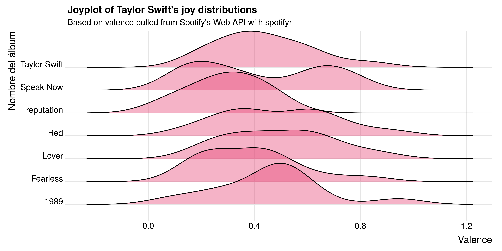
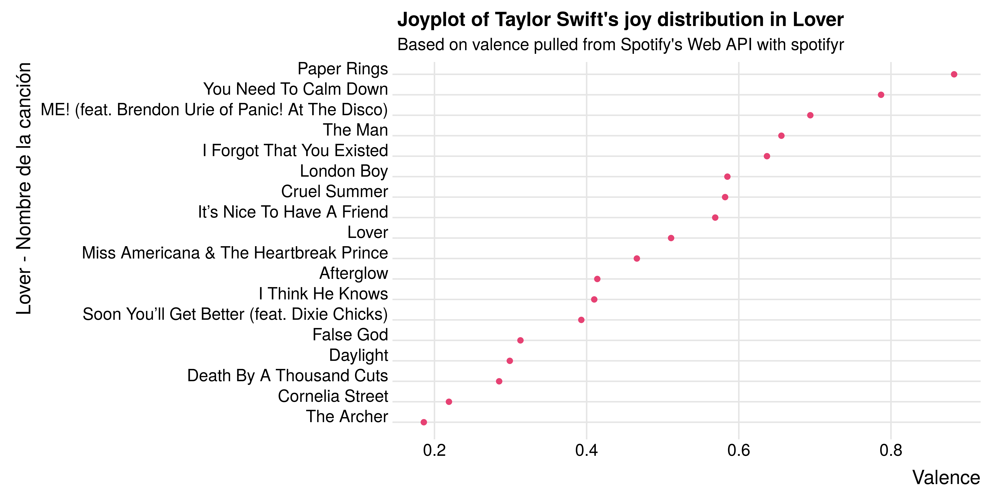
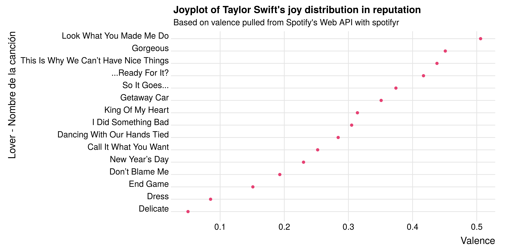

# tayloR 

## Explorando y analizando la discografía de Taylor Swift a través de la API de Spotify y Genius.

La **valencia** es una medida de 0.0 a 1.0 que describe la positividad musical transmitida por una canción. Las canciones con alta valencia suenan más positivas (por ejemplo, feliz, alegre, eufórica), mientras que las pistas con baja valencia suenan más negativas (por ejemplo, triste, deprimido, enojado).

Distribución de valencia para cada álbum de Taylor Swift:

Valencia media para cada álbum de Taylor Swift:

| Nombre del álbum  | Valencia|
|-------------------|---------|
| Lover             | 0.494   |
| Red               | 0.493   |
| 1989              | 0.462   |
| Taylor Swift      | 0.437   |
| Speak Now         | 0.420   |
| Fearless          | 0.386   |
| reputation        | 0.293   |

El álbum más feliz es Lover y el más enojada/triste es reputation.

